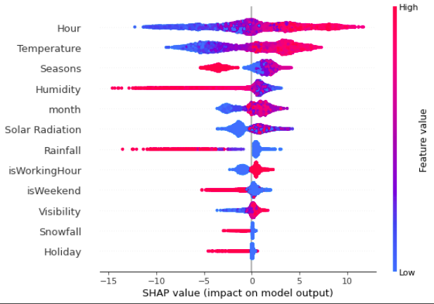
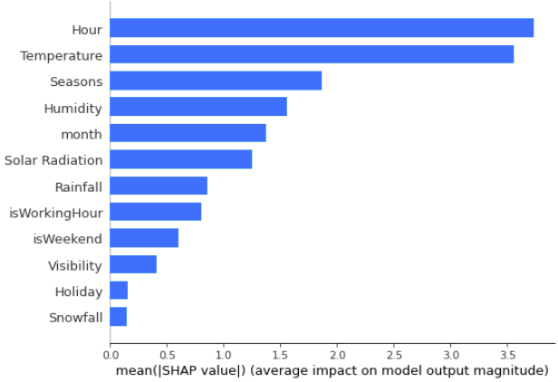

 
# Seoul Bike Sharing Demand Analysis - Regression
# Dataset Information
  Bike sharing systems are new generation of traditional bike rentals where whole process from membership, rental and return back has become automatic. 
Through these systems, user is able to easily rent a bike from a particular position and return back at another position. Today, there exists great 
interest in these systems due to their important role in traffic, environmental and health issues.
# Problem Description:
  Currently Rental bikes are introduced in many urban cities for the enhancement of mobility comfort. It is important to make the rental bike available 
and accessible to the public at the right time as it lessens the waiting time. Eventually, providing the city with a stable supply of rental bikes becomes 
a major concern. The crucial part is the prediction of bike count required at each hour for the stable supply of rental bikes.
# Attribute Information:
  * Date : year-month-day
  * Rented Bike count - Count of bikes rented at each hour
  * Hour - Hour of he day
  * Temperature-Temperature in Celsius
  * Humidity - %
  * Windspeed - m/s
  * Visibility - 10m
  * Dew point temperature - Celsius
  * Solar radiation - MJ/m2
  * Rainfall - mm
  * Snowfall - cm
  * Seasons - Winter, Spring, Summer, Autumn
  * Holiday - Holiday/No holiday
  * Functional Day - NoFunc(Non Functional Hours), Fun(Functional hours)

# Libraries
  * Pandas
  * Numpy
  * Matplotlib
  * Seaborn
  * Scikit-learn
# Algorithms
  * Linear Regression
  * Lesso
  * Ridge
  * Decision Tree
  * Random Forest
  * Gradient Boosting
# Best Model
  From the above algorithms, Random Forest has the highest accuracy.
  * Train:
    * R2   : 0.99
    * RMSE : 1.14
  * Test:
    * R2   : 0.91
    * RMSE : 3.35
# Summary Plot (Using SHAP)   

# Important Features

# Conclusion
* We observed that the bike rental count is high on non-holidays than on holidays.
* During weekdays at 7-9 AM and 5-7 PM, there are sudden spikes in bike count.
* The bike count is high at high temperatures.
* In summer the bike count is the highest and is the lowest in winter.
* When we compare the RMSE and Adjusted R2 of all the models for test data, Random Forest gives the highest Score where the Adjusted R2 score is 0.91 and RMSE is 3.4. So this model is the best for predicting the bike rental count on hourly basis.

# Files Description
<strong>Seoul_Bike_Sharing_Demand_Prediction.ipynb: </strong>Python notebook with all the Data Preprocessing and Regression code.
 
<strong>Seoul Bike Sharing Demand Prediction PPT.pdf: </strong>Presentation of the project.
